# Introduction

The PTMTorrent dataset is available for download from Purdue University via a Globus share.

[Globus](https://www.globus.org) is a data management and transfer service designed for working with large-scale data.

If you have not used Globus before, this document describes the setup steps necessary to get access to the data.
After finishing this guide, you will have downloaded the smallest piece of PTMTorrent onto your computer (less than 1GB of data).
You can follow similar steps to get the rest.

If your institution has large compute resources, the IT staff may already have a large storage system with a Globus front-end, and you can download PTMTorrent directly onto that storage system.

# Steps

1. Visit the PTMTorrent URL from the paper, and you'll get to a Globus login page.

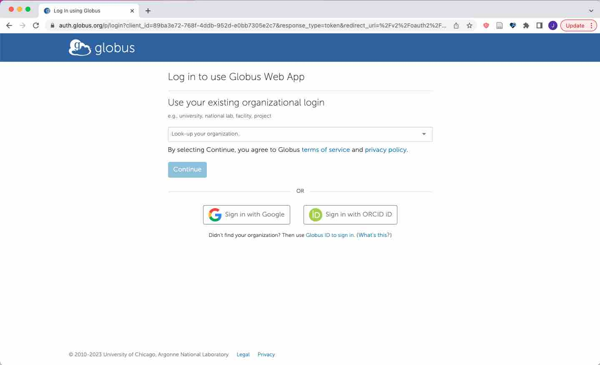

2. Sign in through your organization, Google, or ORCID. I used ORCID in this example.

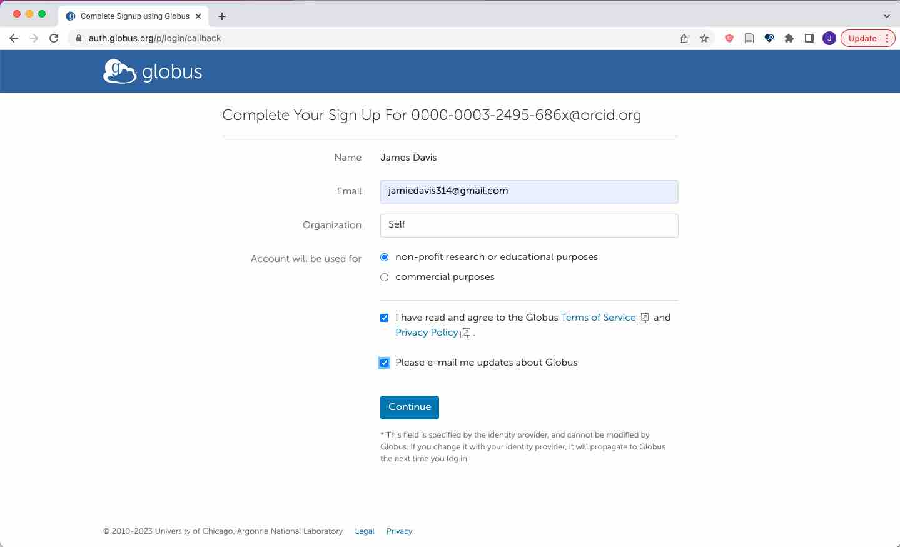

3. Successful login through ORCID.

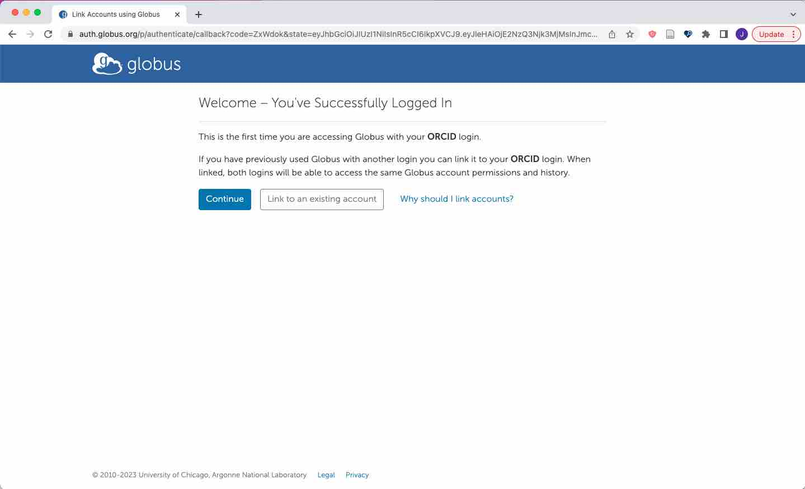

4. Globus asks for some more permissions.

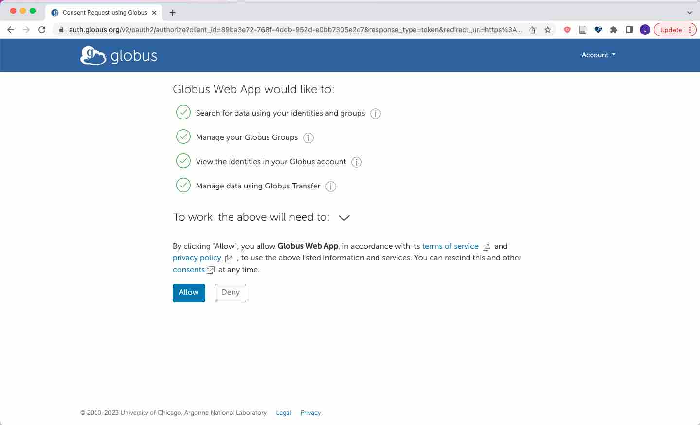

5. We have reached the PTMTorrent share within Purdue's Globus service.

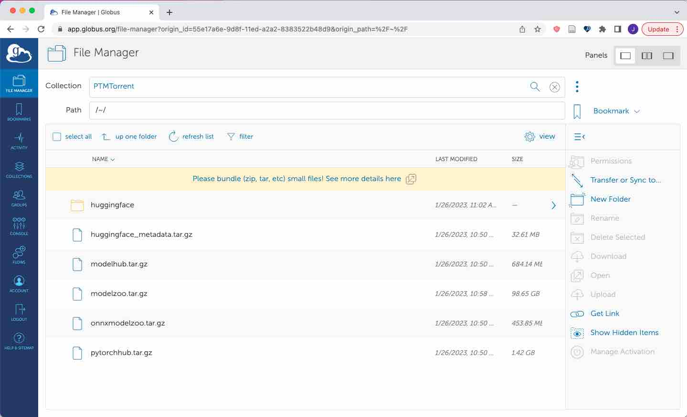

6. *(This is a side note)*. If your institution has a Globus instance, you might be able to right-click on the item of interest, get the link, and access it from your destination Globus. This link cannot be used via `wget` or similar.

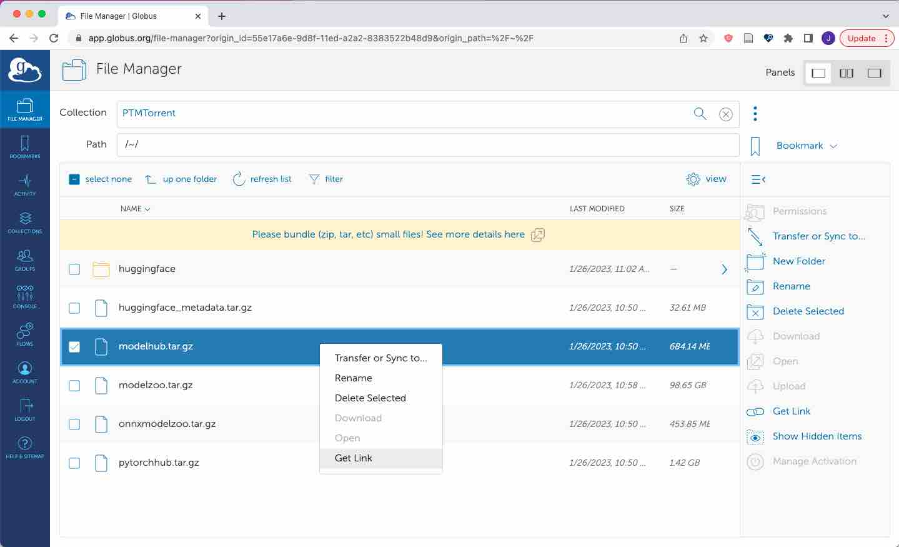

7. Let's download something onto our workstation. You will need to install the Globus client on your machine. Visit https://www.globus.org/globus-connect-personal and follow the instructions.

8. Now we can see two shares in the Globus view: "My Laptop" (your workstation) and "PTMTorrent" (Purdue's Globus share) side by side in two panels. On your local share, pick the folder you want the data to land in. Then, on the PTMTorrent side, select the data you want and press the "Start" button. That button has a left-arrow pointing towards the destination share.

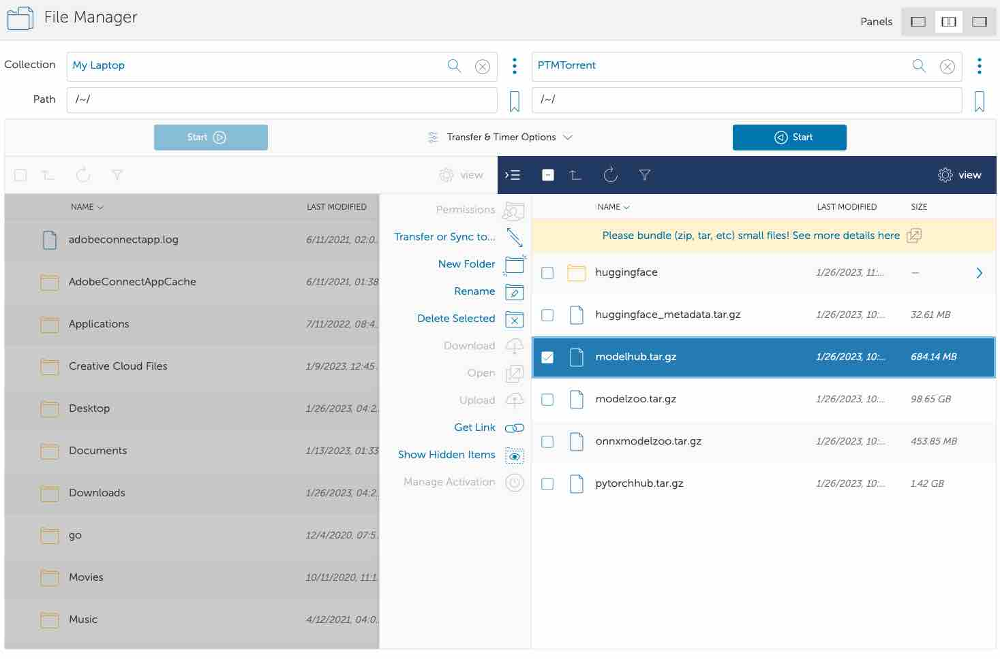

9. In the "Activity" tab we can see that the task has queued.

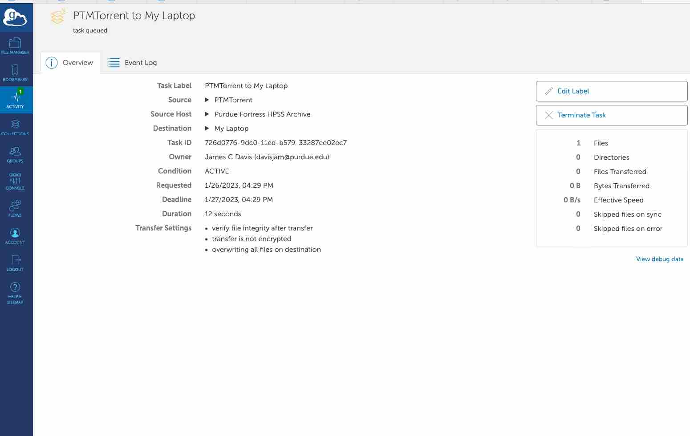

10. An email success notification.

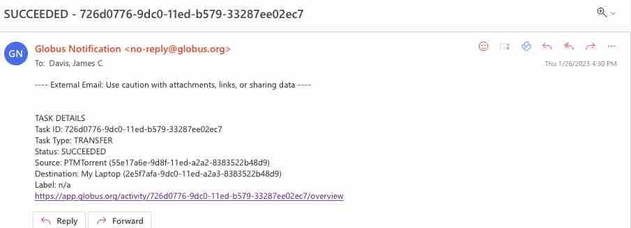

11. I went to my Downloads/ folder and ran `tar -xzvf modelhub.tar.gz` and then `cd data/modelhub`. Let's see what is in the `repos` folder:

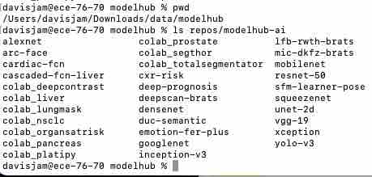

12. Within the `data/modelhub/repos/modelhub-ai/yolo-v3` PTM package, we see a git repository with 8 commits.

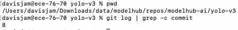

13. Happy mining!
